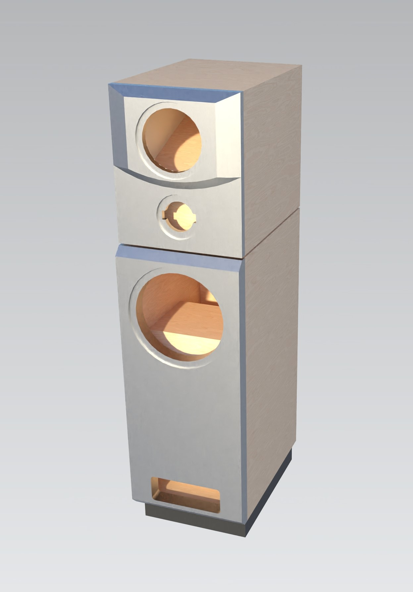
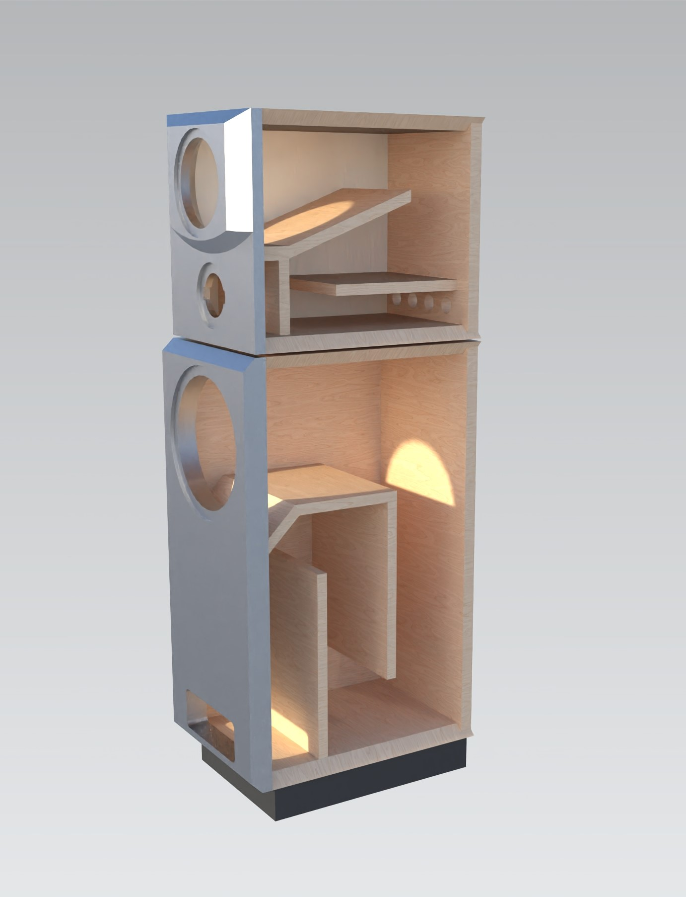
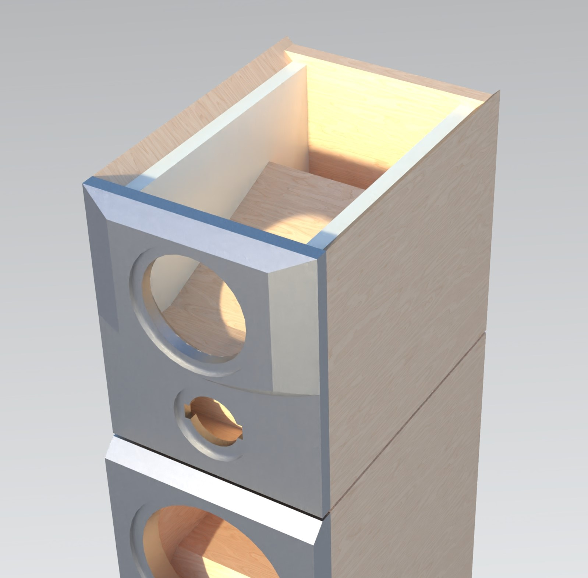

# Jenzen SEAS ER

The files for my [Jenzen ER](http://www.troelsgravesen.dk/Jenzen-SEAS-ER.htm) speakers designed by [Troels Gravesen](http://www.troelsgravesen.dk/Diy_Loudspeaker_Projects.htm)

- [The Cost of Components (Russian)](https://docs.google.com/spreadsheets/d/e/2PACX-1vSB3FNFUVDHjRK6kU6tNd1HyQFS7vgX7NBvUzmXqsyFYa6fWkQUFsxqwkLvuTbK1k98puwC3UfetT3D/pubhtml?gid=0&single=true)

- [Drawings (pdf)](https://github.com/hww/jenzen-er/blob/main/nx/pdf/user_jz_dwg.pdf)

## Sources

There are two different versions:

- ```nxmdf``` - MDF only
- ```nxpw``` - Playwood and MDF

The 3D model files madden with Siemens NX 2212 and located in the ```nxmdf``` or ```nxpw``` folder. There are five main files in the folder:

1. ```jz.prt``` -- The assembly
2. ```jz-dwg.prt``` -- Is the drawings
3. ```bass.prt``` -- The bass driver cabient
4. ```mid.prt``` -- The mid and hi drivers cabient
5. ```stand.prt``` -- The basement 

The main parts designed with top-down design technique. There is the skeleton files:

1. ```bass_skel.prt``` 
2. ```mid_skel.prt```
3. ```stand_skel.prt```

Those skeletons have main definitions of the project and the control sketches. Just open file and hit ```control-e```.

## STEP Files

There are [Step files](nx/step)

## Materials

- Variant ```NXMDF``` - The design adopted to the ```MDF 19mm```  
- Variant ```NXPW``` - The design adopted to the ```playwood``` ```19mm``` and ```23mm```, and ```MDF``` ```19mm```, ```22mm``` 

## Renders

Few images for better understanding the construction.




The left right walls inside the mid driver cabinet has additional 20mm MDF sheets (see image below).


